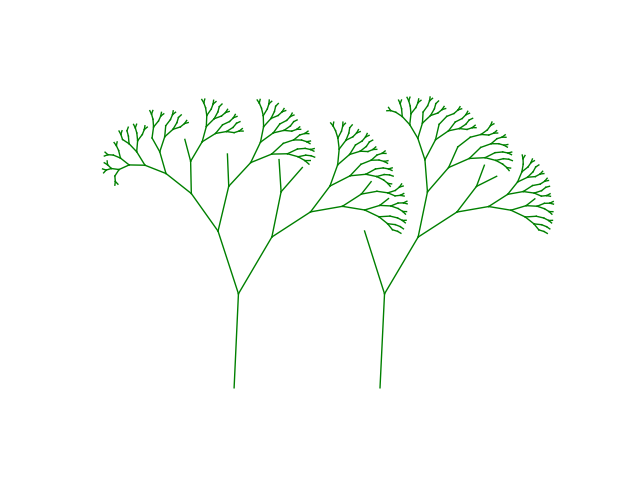
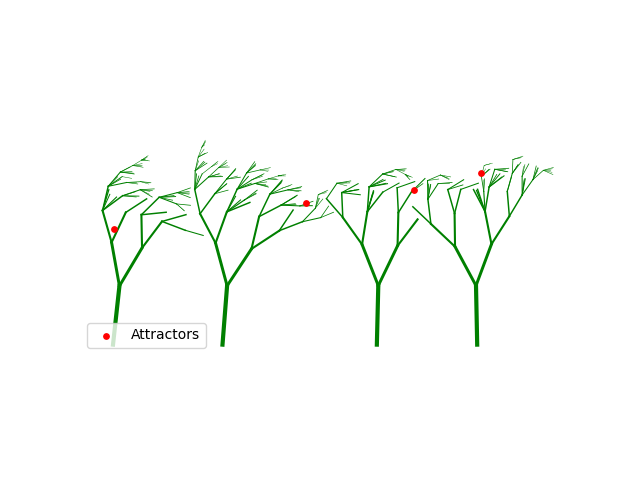
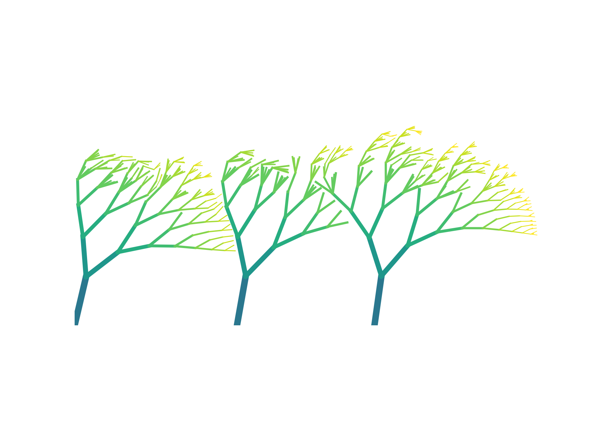
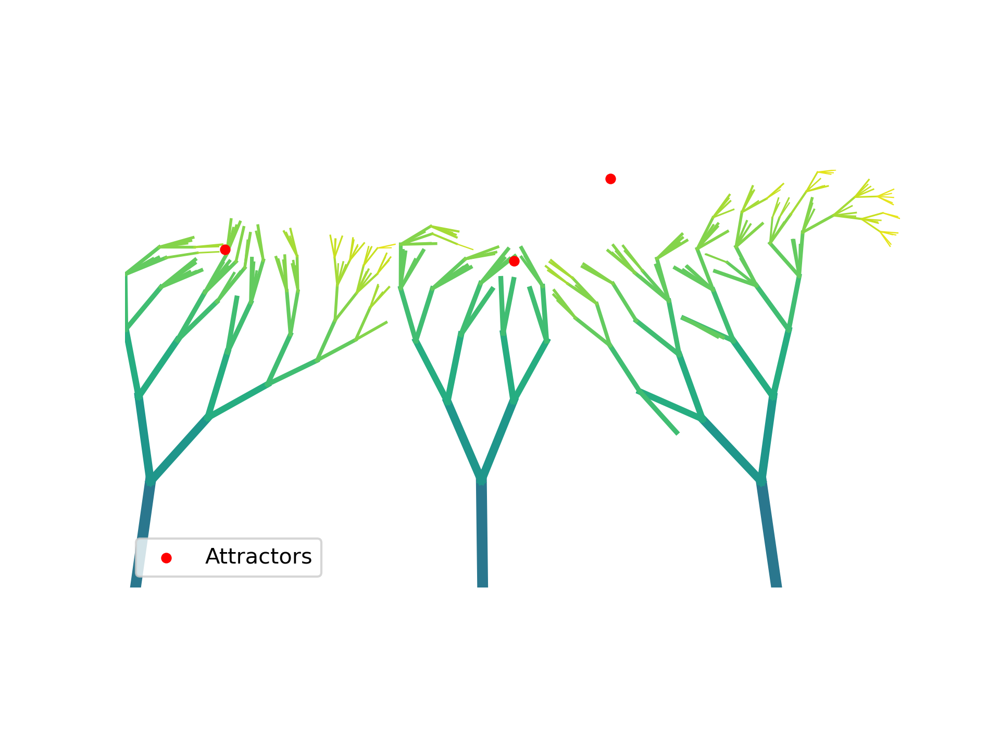
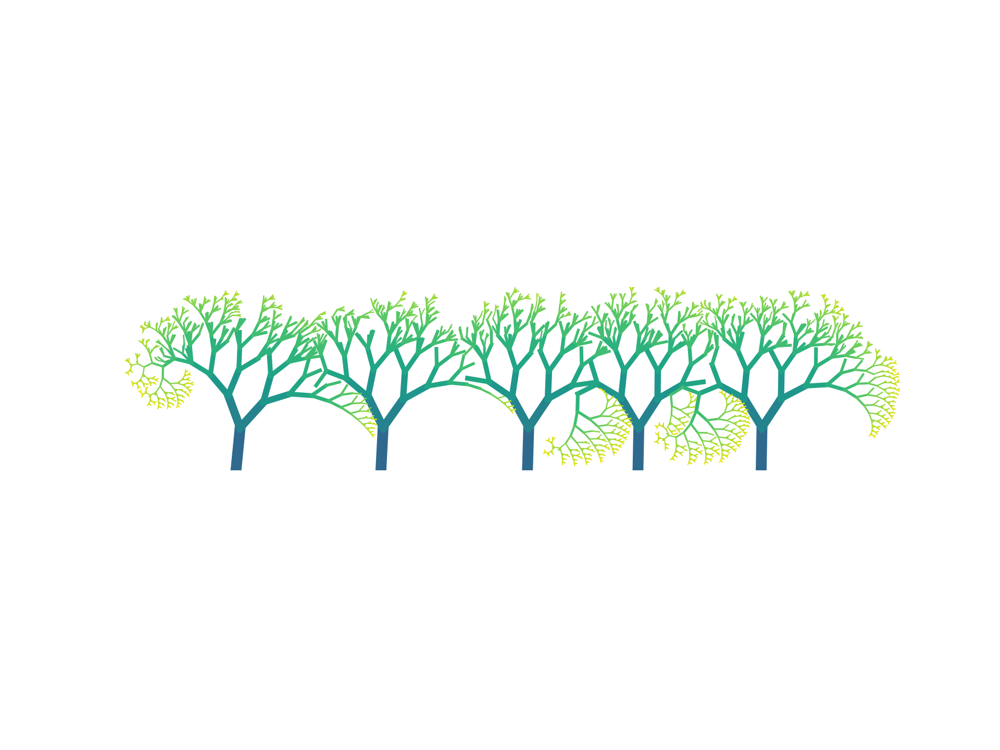

# Assignment 2: Exploring Fractals through Recursive Geometric Patterns

[View on GitHub]({{https://github.com/AdvancedComputationalDesign-SDU/ACD25-Portfolio-Hofgnob/tree/main/A2}})


## Project Overview
This project explores recursive fractal generation through geometric growth rules influenced by spatial forces.  
Tree-like structures are generated using explicit geometric recursion rather than symbolic rewriting. Growth is driven by environmental factors such as wind fields, attractor points, self-avoidance constraints, and region-dependent branching density.

Multiple trees are generated simultaneously using interleaved recursion, producing a coherent forest structure rather than isolated individual fractals. Parameters such as recursion depth, branch angles, spacing between trees, wind strength, and attractor influence allow controlled variation while maintaining emergent complexity.

The final output is a static, high-resolution visualization rendered using Matplotlib, with branch thickness and color encoding structural hierarchy and recursion depth.

---

## Repository structure

```
A2/
├── index.md                                            
├── README.md                                           # Project documentation
├── BRIEF.md                                            # Assignment brief
├── fractal_generator.py                                # Code implementation
└── images/                                             # Intermediary and final image outputs
    ├── branching.png                                   # Assignment brief image
    ├── progress_1.png                                  # Preliminary results
    ├── progress_2.png                                  # Preliminary results
    ├── progress_3.png                                  # Preliminary results
    ├── result_1_strong_wind.png                        # Final results
    ├── result_2_strong_attractors.png                  # Final results
    ├── result_3_mixed_wind_attractors.png              # Final results
    └── result_4_more_depth_mixed_wind_attractors.png   # Final results
```
---

# Documentation for Assignment 2

## Table of Contents

- [Pseudo-Code](#pseudo-code)
- [Technical Explanation](#technical-explanation)
- [Results](#results)
- [References](#references)

## Pseudo-Code

1. **Initialize Global Parameters**
   - Set a fixed random seed `random_seed` for reproducibility.
   - Define global wind direction `wind_vector` and wind strength range `global_wind_strength_range`.
   - Define local wind turbulence using `wind_jitter_range`.
   - Configure attractor field parameters: number of attractors `num_attractors`, base strength `attractor_strength`, influence radius `attractor_radius`, and amplification factor `attractor_boost`.
   - Define tree population rules using `num_trees_range`, `min_tree_distance`, and `max_tree_distance`.
   - Define recursive growth parameters including `max_depth`, `base_branch_angle`, `length_scaling_factor`, and `min_segment_length`.
   - Define canopy-specific rules using `canopy_height` and `canopy_branch_boost`.
   - Define secondary twig fractal parameters using `twig_length_threshold`, `twig_branches`, `twig_angle_spread`, and `twig_length_scale`.
   - Define drawing parameters `min_thickness` and `max_thickness`.

2. **Initialize Geometry Storage**
   - Create an empty list `line_list` to store all generated line segments together with their recursion depth.

3. **Generate Tree Start Positions**
   - Randomly select the number of trees using `num_trees_range`.
   - Place tree trunk start points sequentially along the x-axis.
   - Enforce minimum and maximum spacing between trees using `min_tree_distance` and `max_tree_distance`.

4. **Generate Attractor Points**
   - Extract the horizontal extent of all tree start positions.
   - Place attractor points randomly within this span.
   - Assign attractor heights within a canopy region above ground using a fixed y-range.
   - Store all attractors in the list `attractors`.

5. **Initialize Growth Queue**
   - For each tree start position, enqueue an initial growth state:
     `(start_point, angle=90°, length=100, depth=0)`
   - Store all growth states in a queue `growth_queue` to allow interleaved recursion.

6. **Resolve Recursive Growth**
   - While `growth_queue` is not empty:
     - Pop the next growth state.
     - Apply wind influence using `wind_vector`, `global_wind_strength`, and `wind_jitter_range`.
     - Apply attractor influence based on distance, scaled by `attractor_strength` and `attractor_boost`.
     - Compute the endpoint of the current branch segment.
     - Perform self-avoidance checks against existing geometry using a minimum distance threshold.
     - Store the new segment and its depth in `line_list`.
     - Generate child branches using `base_branch_angle` and `length_scaling_factor`.
     - Spawn additional branches when above `canopy_height`.
     - Generate secondary twig branches when length falls below `twig_length_threshold`.
     - Enqueue all valid child branches back into `growth_queue`.

7. **Static Visualization**
   - Create a Matplotlib figure and axis.
   - Iterate through all stored segments in `line_list`.
   - Compute line thickness based on segment length using `min_thickness` and `max_thickness`.
   - Assign color based on recursion depth using `get_color(depth, max_depth)`.
   - Draw each branch segment.
   - Draw attractor points as markers to indicate their presence.

8. **Export and Display**
   - Set equal aspect ratio and remove axes.
   - Save the final image to the `images/` directory.
   - Display the rendered result.


## Technical Explanation
The fractal generator is implemented as a queue-driven recursive growth system operating on explicit geometric primitives. Each branch is represented as a line segment defined by a start point, direction angle, and length. Growth proceeds iteratively rather than through deep recursive calls, allowing multiple trees to develop concurrently.

Tree placement is controlled through sequential spacing rules rather than global limits. The parameters `min_tree_distance` and `max_tree_distance` explicitly regulate forest density and rhythm. Smaller distances lead to visually clustered growth and overlapping canopies, while larger distances produce more isolated trees with clearer individual silhouettes. This approach provides direct spatial control while preserving stochastic variation.

Branch orientation is further influenced by wind, modeled as a global directional vector `wind_vector` combined with local turbulence defined by `wind_jitter_range`. Wind influence is scaled inversely with branch length, meaning thinner branches respond more strongly than primary trunks. As a result, wind introduces large-scale directional coherence while still allowing fine-scale variation and natural irregularity in the canopy.

Structural complexity emerges through conditional branching rules tied to spatial context. The parameter `canopy_height` defines a vertical threshold above which branch density increases, simulating crown formation. This ensures that the upper regions of the trees show richer structure, while lower regions remain structurally stable. Near branch tips, when segment length falls below `twig_length_threshold`, a secondary twig fractal is triggered. Parameters such as `twig_branches`, `twig_angle_spread`, and `twig_length_scale` control the density, angular variation, and scale of these fine structures, directly affecting perceived detail and texture.

Self-avoidance constraints prevent branches from growing too close to existing geometry. By enforcing a minimum distance threshold, the system reduces visual clutter and intersection artifacts. This constraint encourages outward exploration of space and reinforces the readability of individual branches.

All generated geometry is rendered. Branch thickness is derived from segment length, while color encodes recursion depth using a uniform colormap. This separation of growth computation and visualization enables controlled experimentation.


## Results

# Preliminary results
 
 
 

# Final results
**Result 1** – Strong wind (`wind_vector = (15, 2)`), low attractor strength (`attractor_strength = 1.0`), `max_depth = 10`, `seed = 42` 
 
**Result 2** – No wind (`wind_vector = (0, 0)`), strong attractor influence (`attractor_strength = 3.0`), `max_depth = 10`, `seed = 42`
   
**Result 3** – Mixed wind (`wind_vector = (15, 2)`), strong attractor influence (`attractor_strength = 3.0`), `max_depth = 10`, `seed = 122`
   
**Result 4** – Moderate wind (`wind_vector = (5, 2)`), low attractor strength (`attractor_strength = 1.0`), increased recursion depth (`max_depth = 15`), `seed = 122`
   

## References

- [Matplotlib Documentation](https://matplotlib.org/stable/contents.html)
- [NumPy Documentation](https://numpy.org/doc/stable/contents.html)
- [Shapely Documentation](https://shapely.readthedocs.io)