# Assignment 3: Parametric Structural Canopy

[View on GitHub]({{https://github.com/AdvancedComputationalDesign-SDU/ACD25-Portfolio-Hofgnob/tree/main/A3}})


## Project Overview

This project explores the design of a **parametric structural canopy** using **Grasshopper** and **GhPython (Python 3)**. The system integrates a **NumPy-based heightmap** for surface generation, **parametric tessellation** strategies, and **recursive branching supports** to form a coherent architectural structure. By varying key parameters across surface geometry, tessellation logic, and structural recursion, the project generates a small family of design variations that demonstrate controlled computational exploration and reproducibility.
---

## Repository structure

```
A3/
├── index.md                                            
├── README.md                                           # Project documentation
├── BRIEF.md                                            # Assignment brief
├── parametric_canopy.py                                # Code implementation
├── parametric_canopy.gh                                # Grasshopper document
└── images/                                             # Intermediary and final image outputs
    ├── canopy.png                                      # Assignment brief image
    ├── progress_1.png                                  # Preliminary results
    ├── progress_2.png                                  # Preliminary results
    ├── progress_3.png                                  # Preliminary results
    ├── result_1_perspective.png                        # Results 1
    ├── result_1_right.png                              # Results 1
    ├── result_1_front.png                              # Results 1
    ├── result_1_isometric.png                          # Results 1
    ├── result_1_parameters.png                         # Grasshopper parameters result 1
    ├── result_2_perspective.png                        # Results 2
    ├── result_2_right.png                              # Results 2
    ├── result_2_front.png                              # Results 2
    ├── result_2_isometric.png                          # Results 2
    ├── result_2_parameters.png                         # Grasshopper parameters result 2
    ├── result_3_perspective.png                        # Results 3
    ├── result_3_right.png                              # Results 3
    ├── result_3_front.png                              # Results 3
    ├── result_3_isometric.png                          # Results 3
    └── result_3_parameters.png                         # Grasshopper parameters result 3
```
---

# Documentation for Assignment 3

## Table of Contents

- [Pseudo-Code](#pseudo-code)
- [Technical Explanation](#technical-explanation)
- [Results](#results)
- [References](#references)

## Pseudo-Code

1. **Initialize Global Parameters**
   - Read all Grasshopper inputs controlling resolution, heightmap properties, tessellation settings, and branching parameters.
   - Set a random seed using `seed_everything(seed)` to ensure reproducible geometry generation.

2. **Generate UV Parameter Grid**
   - Create a normalized UV grid using `uv_grid(divU, divV)`.
   - This grid defines sampling resolution consistently across planar grids and NURBS surfaces.

3. **Compute Heightmap**
   - Use `heightmap(U, V, ...)` to generate a scalar field.
   - Combine sinusoidal waves, a radial attractor, and optional noise.
   - The resulting height field `H` controls canopy deformation intensity and pattern.

4. **Create Base Point Grid**
   - If a base surface is provided:
     - Sample points directly from the surface using `sample_point_grid_from_surface(...)`.
     - Deform points along surface normals with `manipulate_points_along_normals(...)`.
   - Otherwise:
     - Generate a planar XY grid using `make_point_grid_xy(...)`.
     - Deform points vertically with `manipulate_points_z(...)`.

5. **Construct Canopy Surface**
   - Build a NURBS surface from the deformed point grid using `surface_from_point_grid(...)`.

6. **Uniform Surface Resampling**
   - Resample the surface using `sample_surface_uniform(...)`.
   - This ensures even tessellation independent of surface deformation.

7. **Panel Tessellation**
   - Generate panels using `tessellate_panels_from_grid(...)`.
   - Support quad or triangular tiling (`n_gon`) with either `n_gon=3` or `n_gon=4` as an input.
   - Optionally inset panels using `panel_scale`.
   - Generate secondary micro-panels between original and inset geometry.

8. **Extract Tessellation Points**
   - Collect all panel corner points to act as potential snapping or reference points.

9. **Estimate Branching Envelope**
   - Use `estimate_branching_envelope(...)` to approximate horizontal reach of recursive supports.
   - This prevents supports from going outside canopy edges.

10. **Place Support Roots**
    - Compute a bounding box of the canopy surface.
    - Place support roots on a jittered grid within a safe envelope.
    - Enforce minimum spacing between roots.

11. **Generate Branching Supports**
    - Create recursive branching structures with `generate_supports(...)`.
    - Branch length, angle, depth, and variation define structural character.
    - Terminal branches snap to the canopy surface.
    - Recursion happen in alternating planes for each depth level.

12. **Prepare Outputs**
    - Output canopy surface, point data, heightmap values, panels, micro-panels, support curves, root points, tessellation points, and normalized branching depth.


## Technical Explanation

The parametric canopy system is organized as a linear pipeline that transforms numerical parameters into geometric structure. Each stage operates on explicit geometric data, allowing individual components to be adjusted independently while maintaining overall coherence.

### Heightmap and Surface Deformation

The primary canopy geometry is driven by a scalar height field generated in the `heightmap()` function. This function combines three components: a sinusoidal wave field (`frequency`, `phase`) that introduces global periodic variation, a radial attractor controlled by `radial_strength` and `radial_falloff` that concentrates deformation toward the center of the surface, and optional stochastic variation using `noise_strength`. The combined field is scaled by `amplitude`, allowing global control over deformation magnitude.

The resulting height values are applied to a base point grid either vertically or along surface normals. When no base surface is provided, `manipulate_points_z()` offsets points directly in the Z-direction, producing a heightmap-driven canopy. When a base surface exists, `manipulate_points_along_normals()` displaces points along local surface normals, preserving the underlying curvature and orientation of the reference surface. This dual deformation strategy allows the system to operate both as a surface modifier and as an independent form generator.

### Surface Construction and Resampling

After deformation, the point grid is converted into a continuous NURBS surface using `surface_from_point_grid()`. This surface represents the geometric canopy envelope but is not used directly for panelization. Instead, it is resampled uniformly using `sample_surface_uniform()`.

Uniform resampling decouples tessellation density from surface curvature and deformation intensity. By sampling the surface again using a fresh UV grid (`divU`, `divV`), the system ensures that panels remain evenly distributed even in areas of high curvature, improving both visual consistency and downstream structural logic.

### Tessellation Logic

Canopy panels are generated from the uniformly sampled surface using `tessellate_panels_from_grid()`. The function supports both quad (`n_gon = 4`) and triangular (`n_gon = 3`) tessellation strategies, allowing different structural and aesthetic outcomes. Panel topology is derived directly from the sampled point grid, ensuring full surface coverage.

Panels can be optionally inset using the `panel_scale` parameter. When `panel_scale < 1.0`, panels are scaled toward their centroid, creating an offset frame. The gap between the original and inset geometry is filled with secondary triangular micro-panels, increasing surface articulation and visual depth. This layered tessellation strategy allows local refinement without increasing the primary grid resolution.

### Branching Envelope and Root Placement

Before generating supports, the system computes a conservative estimate of the maximum horizontal reach of the branching structure using `estimate_branching_envelope()`. This function evaluates how recursion depth (`rec_depth`), initial branch length (`br_length`), length reduction (`len_reduct`), and branching angle (`angle`) collectively influence lateral spread. The resulting envelope radius defines a safety margin around the canopy footprint.

Root points are placed within a clamped bounding box derived from the canopy surface, reduced by the computed envelope in the X and Y directions. Supports are distributed using a tight grid with controlled jitter (`jitter_strength`) and validated using a minimum spacing constraint (`anchor_radius`). This ensures that all supports can reach the canopy without intersecting its boundary while maintaining a balanced yet non-uniform structural layout.

### Recursive Branching Supports

Support geometry is generated using a depth-controlled recursive algorithm implemented in `generate_supports()`. The system relies on explicit geometric rules rather than physical simulation, making branching behavior predictable, stable, and fully parameter-driven.

Each support starts from a root point in `roots_out` and grows initially in the vertical direction `(0, 0, 1)`. The recursive function `branch(pt, direction, curr_len, curr_depth, axis)` carries the full local state of each branch, including position, direction, remaining length, recursion depth, and rotation axis. At each step, a straight segment is created by advancing the branch along its direction by `curr_len`.

Branch divergence is controlled by `n_children` and `angle`, producing a symmetrical angular spread, while `angle_variation` introduces bounded randomness for organic variation. After each recursion level, the branching plane is rotated using `rs.VectorRotate(axis, 90, direction)`, causing successive branches to alternate between orthogonal planes and generating a fully three-dimensional structure.

Branch length is reduced at each level using `length_reduction`, ensuring tapering and convergence of the recursion. When `curr_depth == 1`, branches terminate by snapping to the canopy surface using `rs.SurfaceClosestPoint()` and `rs.SurfaceNormal()`, guaranteeing clean structural connections. Branch depth is stored in `curves_with_depth`, enabling depth-based visualization or post-processing in Grasshopper.

### Output Structure

The system outputs all intermediate and final geometry explicitly: canopy surface, points, panels, micro-panels, support curves, and metadata such as height values and normalized branching depth. This separation of computation and output enables flexible downstream visualization, analysis, and fabrication workflows.


## Results
### Preliminary results
 
 
 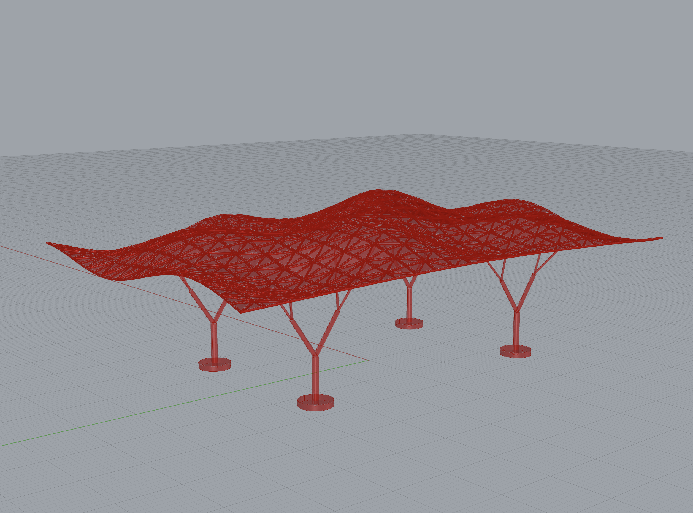

### Final results
**Result 1 - baseline** 
 
 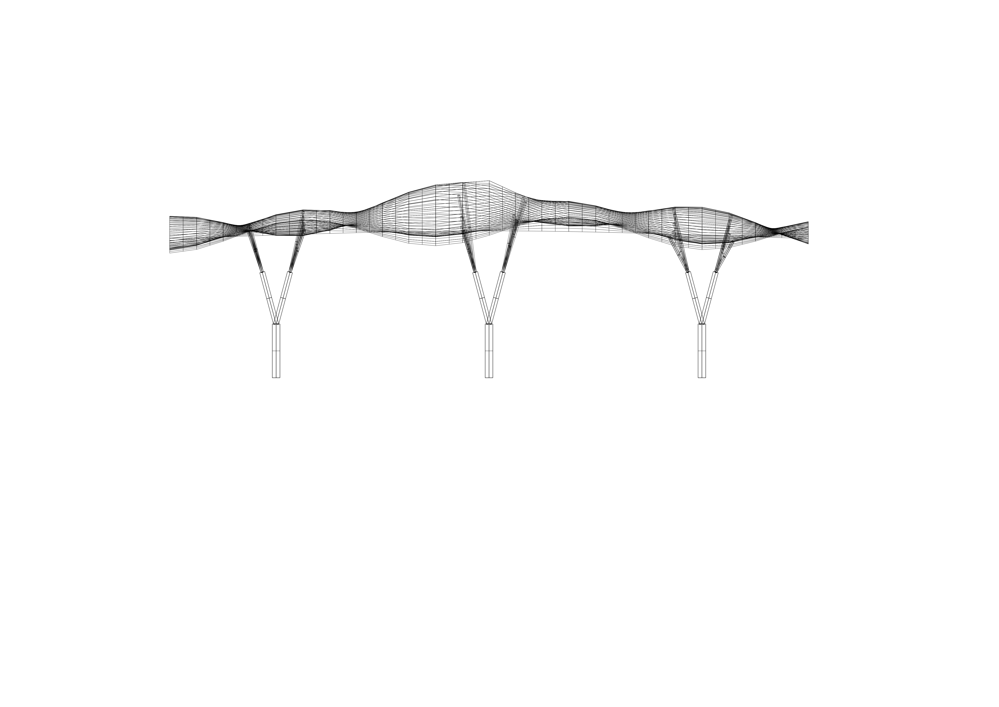
 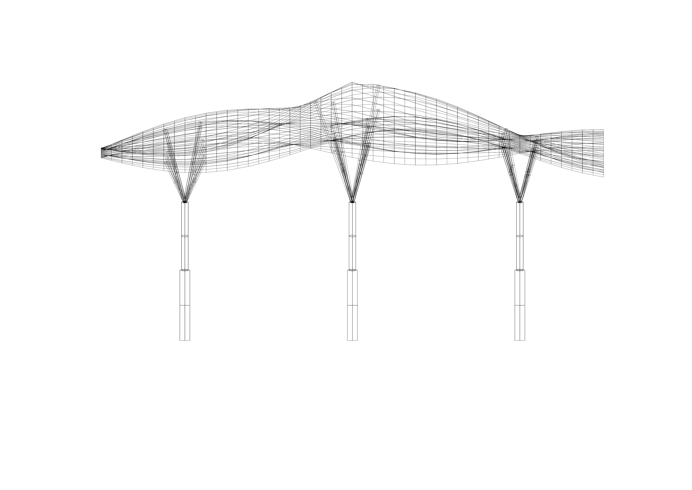
 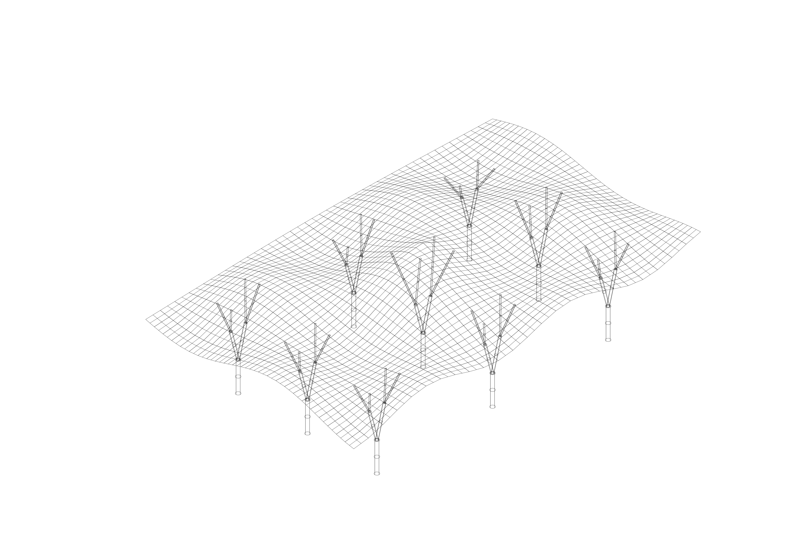

**Result 2 - Supports and tessellation changed** 
 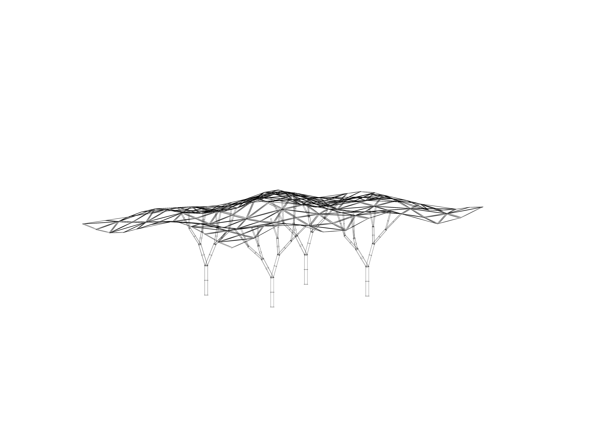
 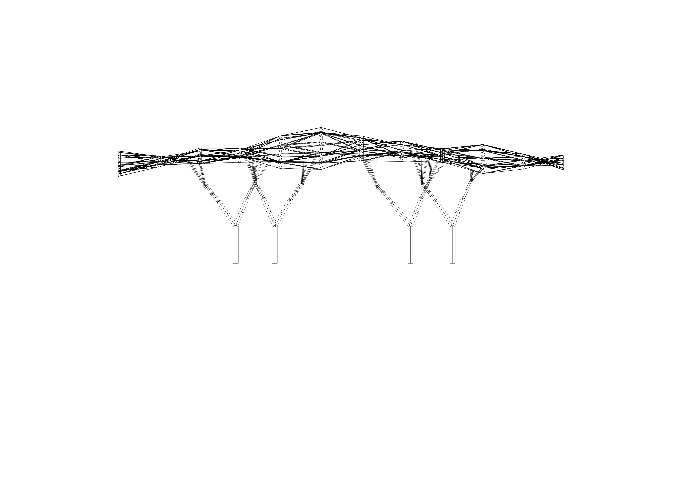
 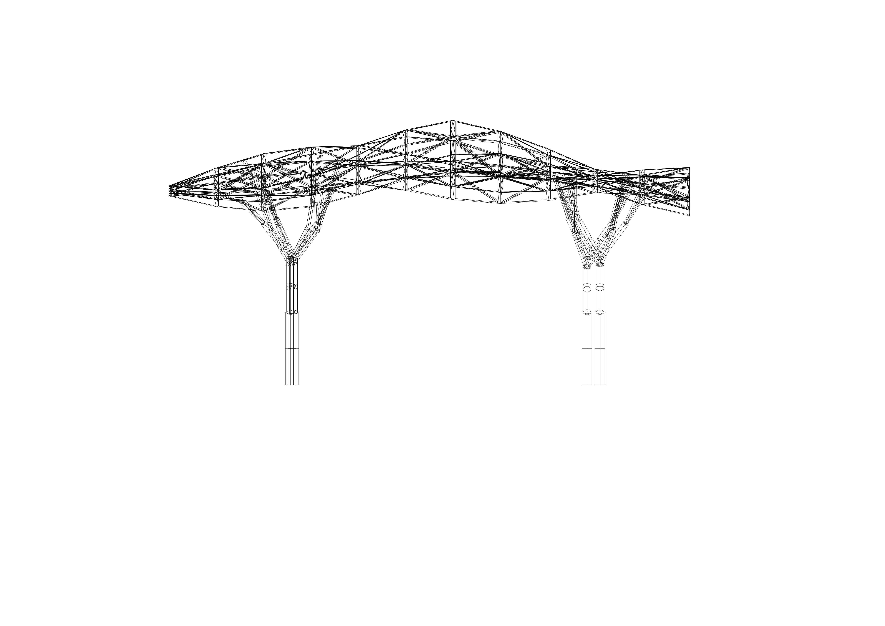
 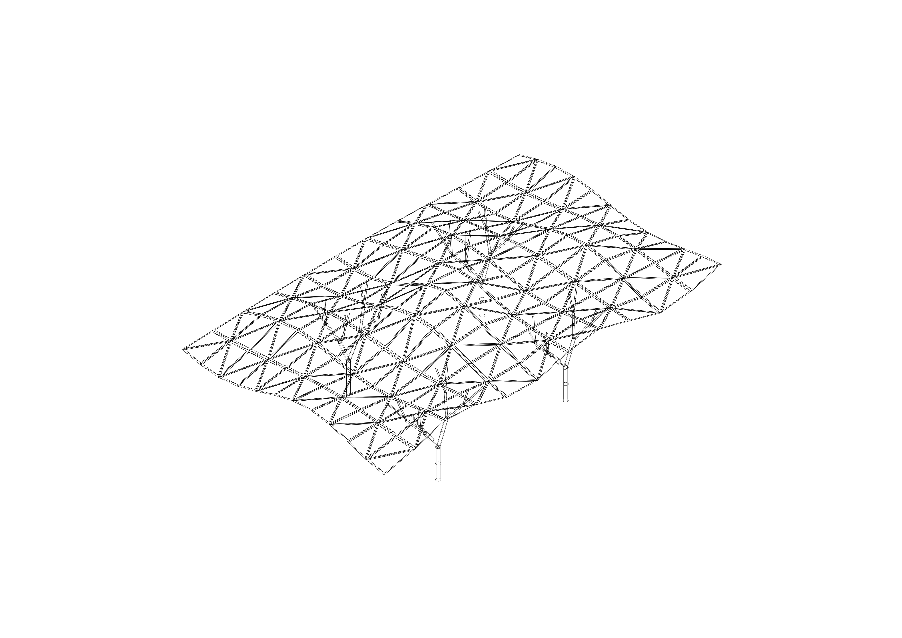

**Result 3 - Supports and heightmap changed**
 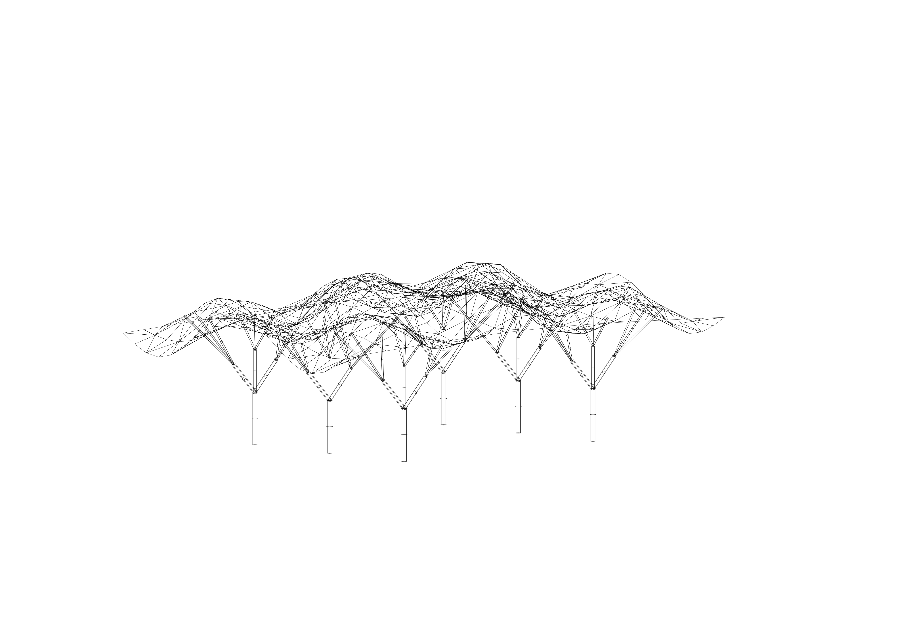
 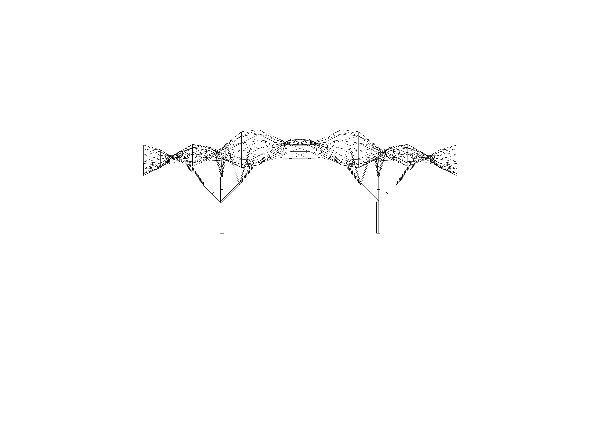
 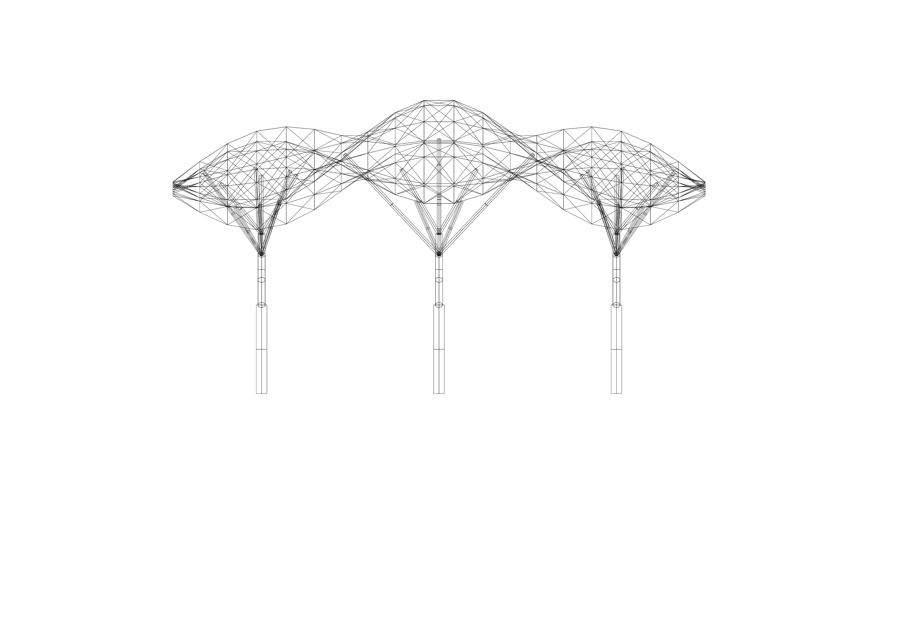
 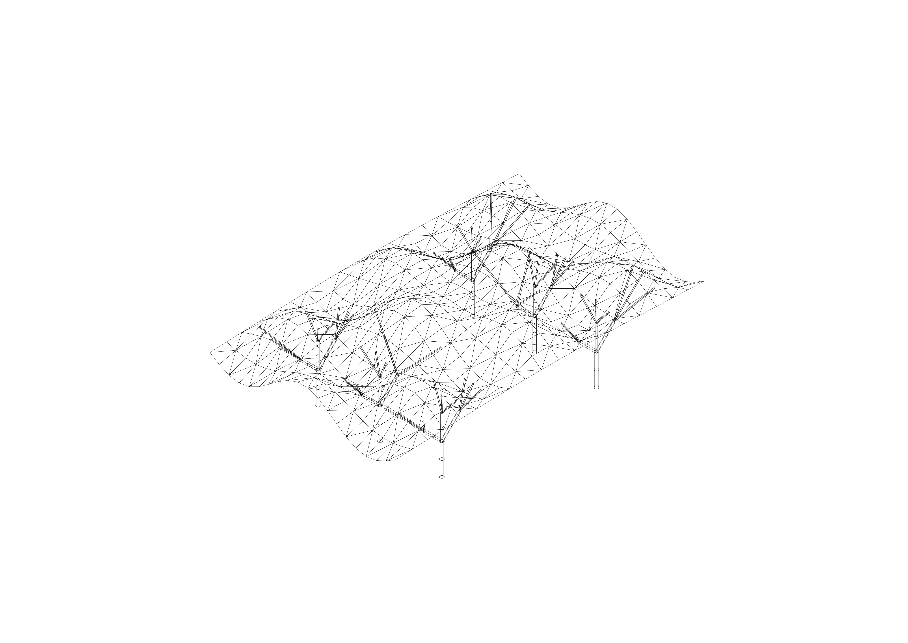

### Parameter Tables
The changed parameter are highlighted in the tables below. Screenshot of the parameters can be found in \images
### Heightmap Parameters
| Parameter         | Result 1 (Baseline) | Result 2           | Result 3           |
|:------------------|:--------------------|:-------------------|:-------------------|
| divU              | 25                  | **25 → 12**        | **12 → 20**        |
| divV              | 25                  | **25 → 12**        | **12 → 20**        |
| amplitude         | 80                  | 80                 | **80 → 90**        |
| frequency         | 1.2                 | 1.2                | **1.2 → 1.5**      |
| phase             | 0.0                 | 0.0                | 0.0                |
| radial_strength   | 1.3                 | 1.2.               | **1.3 → 1.5**      |
| radial_falloff    | 2.5                 | 2.5                | 2.5                |
| noise_strength    | 2.0                 | 2.0                | 2.0                |

### Tessellation Parameters
| Parameter         | Result 1 (Baseline) | Result 2           | Result 3           |
|:------------------|:--------------------|:-------------------|:-------------------|
| n_gon             | Quad (4)            | **Quad → Triangle**| Triangle.          |
| panel_scale       | 1.00                | **1.00 → 0.85**    | **0.85 → 1.00**    |

### Support / Branching Parameters
| Parameter         | Result 1 (Baseline) | Result 2           | Result 3           |
|:------------------|:--------------------|:-------------------|:-------------------|
| rec_depth         | 3                   | **3 → 4**          | **3 → 4**          |
| br_length         | 84                  | 84                 | **84 → 100**       |
| len_reduct        | 1.00                | **1.00 → 0.80**    | 0.80               |
| n_branches        | 2                   | 2                  | **2 → 3**          |
| angle (deg)       | 30                  | **30 → 60**        | **60 → 45**        |
| angle_variation   | 0                   | **0 → 10**         |  **10 → 0**        |
| z_roots           | 0                   | 0                  | 0                  |
| n_roots           | 9                   | **9 → 4**          | **4 → 6**          |
| anchor_radius     | 150                 | 150                | 150                |
| jitter_strength   | 0.0                 | **0.0 → 0.5**      | **0.5 → 0.0**      |
| x_offset          | 0.0                 | 0.0                | 0.0                |
| y_offset          | 0.0                 | 0.0                | 0.0                |
| seed              | 666                 | 666                | 666                |


## References

- [NumPy Documentation](https://numpy.org/doc/stable/contents.html)

- **Rhino & Grasshopper**
  - [Rhino.Python Guides](https://developer.rhino3d.com/guides/rhinopython/)
  - [rhinoscriptsyntax](https://developer.rhino3d.com/api/rhinoscriptsyntax/)
  - [RhinoCommon SDK](https://developer.rhino3d.com/api/RhinoCommon/html/N_Rhino_Geometry.htm)