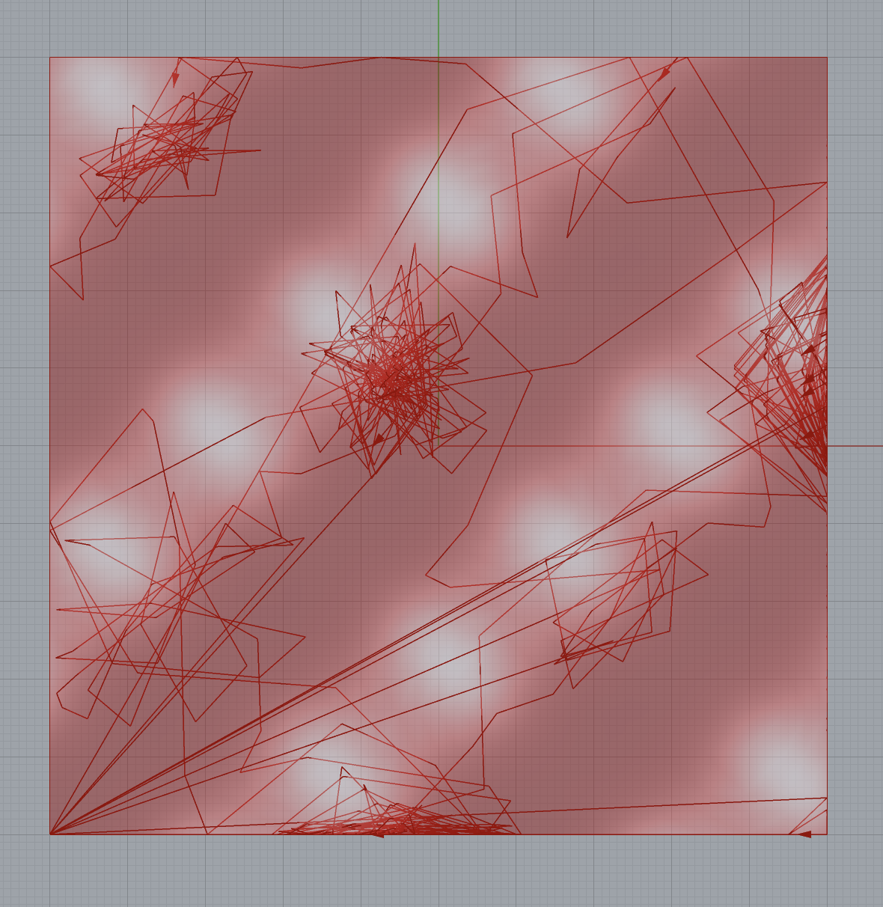

# Assignment 4: Agent-Based Modeling for Surface Panelization

[View on GitHub]({{https://github.com/AdvancedComputationalDesign-SDU/ACD25-Portfolio-Hofgnob/tree/main/A4}})


## Project Overview

This project investigates an **agent-based system for surface panelization** using **Grasshopper** and **GhPython (Python 3)**. A population of autonomous agents is deployed on a continuous surface and navigates it in normalized UV space while responding to **surface-derived vector fields** and **self-generated density feedback**. Rather than directly tessellating the surface using predefined geometric rules, the system leverages emergent agent behavior to generate spatial patterns that can be interpreted as drivers for adaptive panel density and surface rationalization.

Each agent samples local geometric information from the surface, including projected surface normals and accumulated coverage, and updates its motion accordingly. Over time, agent trajectories and clustering behavior reveal areas of geometric intensity and differentiation, which can be used downstream to guide panel refinement, subdivision, or structural articulation.

---

## Repository Structure

---

## Repository Structure

```
A4/
├── index.md                    # Do not edit front matter or content
├── README.md                   # Project documentation; Keep front matter, replace the rest with your project documentation
├── BRIEF.md                    # Assignment brief; Do not edit front matter or content
├── agent_panelization.gh       # grasshopper definition
├── surface_generator.py        # surface_generator implementation
├── agent_builder.py            # agent_builder implementation
├── agent_simulator.py          # agent_simulator implementation
└── images/                     
    ├── agent_based.png         # Assignment brief image
    ├── result_1.png            # Screenshot from grasshopper 
    ├── result_2.png            # Screenshot from grasshopper 
    └── result_3.png            # Screenshot from grasshopper 

```

---

# Documentation for Assignment 4

## Table of Contents

- [Pseudo-Code](#pseudo-code)
- [Technical Explanation](#technical-explanation)
- [Results](#results)
- [References](#references)

## surface_generator.py
## Pseudo-Code
Main function of the surface generator has been explained in assignment 3. Link for repository can be found below:
[View on GitHub]({{https://github.com/AdvancedComputationalDesign-SDU/ACD25-Portfolio-Hofgnob/tree/main/A3}})

### agent_builder.py
1. **Initialize Global State**
   - Import Rhino, NumPy, and Grasshopper libraries.
   - Set a fixed random seed using `seed_everything(seed)` to ensure reproducible agent behavior.

2. **Extract Surface-Derived Fields**
   - Use `compute_fields_from_surface(surface, divU, divV)` to sample the input surface.
   - Construct a normalized UV grid.
   - Evaluate surface normals at each UV sample.
   - Project surface normals onto the XY plane to derive a tangential flow field (`flow_u`, `flow_v`).

3. **Initialize Coverage Field**
   - Create a scalar grid matching the flow field resolution.
   - Use this field to store accumulated agent visits (pheromone-like memory).

4. **Instantiate Agents**
   - For each agent:
     - Assign a random normalized UV position.
     - Store references to the surface, flow fields, and coverage field.
     - Initialize velocity, age, and path history.

5. **Agent Update Loop**
   - For each simulation step:
     - Agents sense local flow and coverage gradients.
     - Agents update velocity using damped integration.
     - Agents move in UV space with boundary constraints.
     - Agents project their updated position back onto the surface.
     - Agents deposit coverage and increment age.
     - Agents deactivate when `max_age` is reached.

6. **Grasshopper Persistence**
   - Store agent instances inside the component to preserve state between recomputes.
   - Reset the simulation when the `reset` input is triggered.

---
## Technical Explanation

### Surface Field Extraction

The agent system derives its primary environmental input directly from the surface geometry. In `compute_fields_from_surface()`, the surface is sampled on a normalized UV grid defined by `divU` and `divV`. At each grid cell, the surface normal is evaluated and projected onto the XY plane. This projection produces a two-dimensional vector field aligned tangentially to the surface, encoding curvature and orientation indirectly through normal variation.

This vector field acts as a continuous directional guide for agent motion, allowing agents to respond to geometric features such as ridges, valleys, and inflection zones without explicitly computing curvature values.

### Agent Representation and State

Each agent is implemented as an instance of the `Agent` class, encapsulating both spatial and behavioral state. Agents store their position in normalized UV coordinates rather than world space, ensuring surface-agnostic movement and consistent boundary handling. World-space positions are derived only when projecting agents back onto the surface using `EvaluateSurface()`.

Agents maintain internal attributes for velocity, age, and path history, enabling both temporal simulation and post-analysis of trajectories.

### Sensing and Environmental Feedback

Agent perception is implemented in the `sense()` method. Each agent samples the local vector direction from the flow field using cached UV indices. In addition to surface-driven flow, agents also read from a shared coverage field that records how frequently each UV cell has been visited.

By computing local gradients in the coverage field, agents are repelled from regions of high density. This self-avoidance mechanism prevents excessive clustering and promotes spatial exploration, resulting in more evenly distributed trajectories across the surface.

This feedback loop produces a balance between attraction and dispersion. While the surface-derived flow field encourages agents to align with geometric features, the coverage-based repulsion introduces local self-avoidance. As a result, agents neither collapse into singular clusters nor distribute uniformly, but instead form differentiated spatial densities that encode surface behavior over time.


### Motion Integration and Boundary Handling

Agent motion is updated using a damped velocity integration scheme implemented in `decide()`. Each agent combines its previous velocity with the locally sensed flow direction, scaled by a strength factor. A damping coefficient reduces velocity over time, preventing oscillation and ensuring smooth, stable trajectories. To maintain numerical robustness, a maximum speed threshold clamps the velocity magnitude, avoiding abrupt jumps in UV space.

Movement is performed in normalized UV coordinates inside the `move()` method. After updating position, agents are constrained to remain within the [0,1] UV domain. When an agent reaches a boundary, a reflective bounce condition is applied: the agent’s position is clamped to the boundary value and the corresponding velocity component is inverted. This bounce behavior preserves kinetic continuity while ensuring agents remain on the surface parameter domain rather than being reset or removed.

### Projection and Coverage Deposition

After movement, agents are projected back onto the surface by remapping normalized UV coordinates to the surface domain. Each agent deposits a scalar value into the coverage field at its current grid cell, incrementally building a global density map that feeds back into subsequent sensing steps.

Agents age incrementally and are marked inactive once they exceed `max_age`, allowing the simulation to stabilize over time.

### Grasshopper Integration

To support continuous simulation inside Grasshopper, agent instances are stored on the component itself using `GH_ScriptInstance`. This persistence mechanism ensures that agent state is preserved between solution updates, enabling iterative simulation without recomputation from scratch. A manual `reset` input allows controlled reinitialization of the system.

---
## agent_simulator.py
## Pseudo-Code

1. **Receive Agent Instances**
   - Read the `agent_component` reference coming from `agent_builder`.
   - Extract the live list of agent instances stored on the Grasshopper component.

2. **Step Simulation**
   - For each agent in the list:
     - Call `agent.update(agents)` to advance behavior by one timestep.
     - Pass the full agent list so each agent can sense neighbors.

3. **Collect Visualization Data**
   - Initialize empty lists for:
     - `points`   → agent positions
     - `vectors`  → velocity direction indicators
     - `curves`   → agent trails

4. **Draw Agent Positions**
   - For each agent:
     - Append its current 3D surface position to `points`.

5. **Draw Velocity Vectors (Optional)**
   - If `draw_vectors` is enabled:
     - Read the real surface UV domains.
     - Take a small step in normalized UV along the velocity direction.
     - Clamp the UV coordinates to [0,1].
     - Remap normalized UV to real surface UV.
     - Evaluate the surface at the new UV location.
     - Draw a line from the agent position to the new point.

6. **Draw Agent Paths (Optional)**
   - If `draw_paths` is enabled and the path length > 1:
     - Draw a polyline from the stored agent path.

7. **Output Geometry**
   - Output `points`, `vectors`, and `curves` to Grasshopper.

---

## Technical Explanation


The `agent_simulator.py` script manages the simulation's progression and visual output in Rhino. It is responsible for advancing the simulation step-by-step, iterating within Grasshopper, and rendering agent data as geometric objects. This decouples the agent's behavior (defined in `agent_builder.py`) from the simulation's execution.

Agents' states (like position, velocity, and path history) are preserved between updates. The simulator calls `agent.update(agents)` for each agent, enabling them to interact with their neighbors.

Visualization options include:
- **Position**: Shows the agent's current location on the surface.
- **Velocity**: Draws a vector indicating the agent's direction of movement along the surface curvature.
- **Paths**: Traces an agent's historical path, revealing larger patterns of movement.

This setup allows for a modular system that can be controlled in real-time within Grasshopper, with each recompute driving one step of the simulation.

## Results
- While the agent-based system successfully produced dynamic movement patterns, these results were not easily convertible into a viable panelization approach.
 
 
 

## References

- [NumPy Documentation](https://numpy.org/doc/stable/contents.html)


